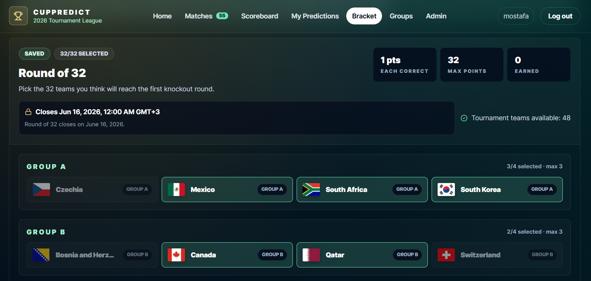

  

  

    
    
    
    
  

## About

I am a **Software Support Specialist at SDCG**, working with business software, SQL Server, production troubleshooting, IIS environments, and operational reporting.

Alongside my professional role, I build full-stack applications using **React, Laravel, JavaScript, PHP, Python, SQL, and Supabase**.

I am developing toward a full-time software engineering role, combining application development with practical experience diagnosing real production systems.

## Professional Experience

### Software Support Specialist — SDCG

`January 2026 – Present` · Beirut, Lebanon

- Support and troubleshoot Visual Dolphin ERP installations, configurations, permissions, and customer issues
- Investigate application and database problems using Microsoft SQL Server and SQL profiling tools
- Work with IIS hosting, SQL Server backups, maintenance plans, Agent jobs, and remote environments
- Build and maintain business reports using Crystal Reports and DevExpress
- Translate operational requirements into report changes, SQL fixes, and practical software solutions

## Featured Project

### [World Cup Predictor 2026](https://github.com/Mostafa-Al-Bilani/world-cup-predictor-2026)

A full-stack tournament prediction platform built around user accounts, social competition, scoring logic, and live match data.

**Built with:** React · Vite · Tailwind CSS · Supabase · PostgreSQL · GitHub Actions

  

Key functionality includes:

- Authentication, profiles, and password recovery
- Match, champion, and knockout-bracket predictions
- Private groups and group leaderboards
- Automated scoring and live match-data synchronization
- Admin management, automated tests, and deployment workflows

  
  

## Technical Stack

  

 

**Languages:** JavaScript, PHP, Python, SQL  
**Frontend:** React, HTML, CSS, Tailwind CSS, Bootstrap  
**Backend:** Laravel, Node.js, Supabase, REST APIs  
**Databases:** Microsoft SQL Server, PostgreSQL, MySQL  
**Development tools:** Git, GitHub, Docker, Postman, VS Code  
**Professional tools:** IIS, Crystal Reports, DevExpress, Visual Dolphin ERP

## Current Development Focus

- Building production-ready applications with React and Laravel
- Improving API design, relational database design, and application architecture
- Strengthening automated testing, authorization, and application security
- Writing clearer and more maintainable code
- Converting real operational problems into useful software features

---

## Let's Connect

I am open to **junior full-stack, backend, and software development opportunities**, as well as selected freelance projects.

